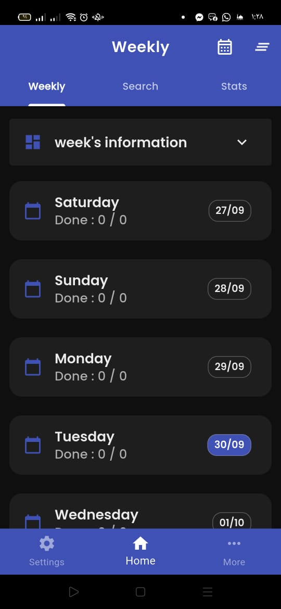
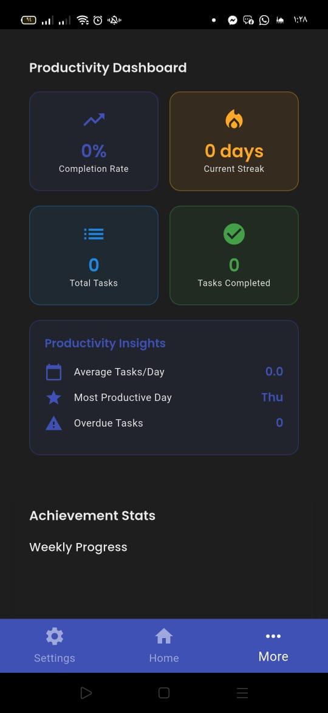
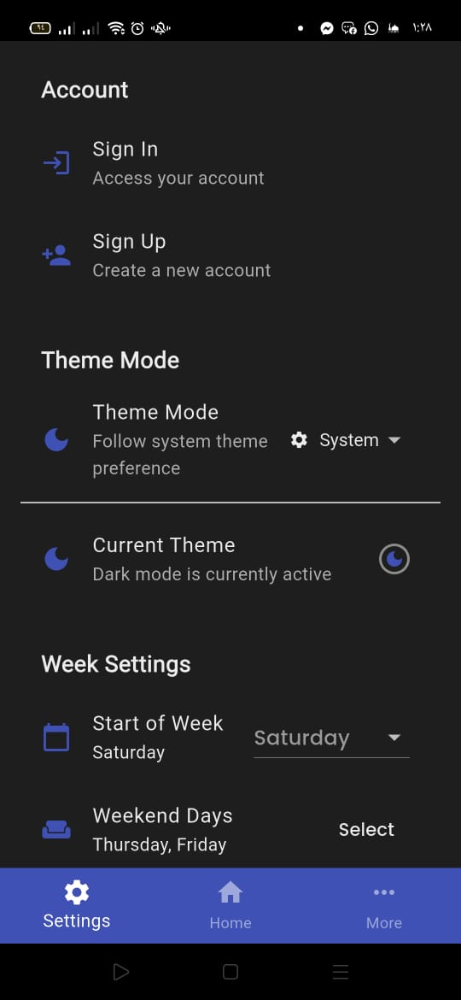

### Weekly Dashboard

A cross-platform Flutter app to plan, track, and visualize your weekly tasks. It features a clean dashboard, localized UI (English/Arabic), offline-first storage with Hive, backup/restore, notifications, analytics, and responsive layouts for mobile, tablet, desktop, and web.

---

### Features

- **Weekly task management**: Create, edit, complete, and delete tasks organized by day of week.
- **Configurable week settings**: Set week start day and weekend days to match regional preferences.
- **Statistics and insights**: View completion percentage, per-day stats, streaks, charts, and progress overviews.
- **Search and filtering**: Fast, fuzzy task search powered by `fuse`.
- **Notifications and reminders**: Local notifications using `flutter_local_notifications` and `timezone`.
- **Backup & restore**: One-tap JSON backup/restore of tasks and settings using `path_provider`.
- **Localization (i18n)**: English and Arabic with `AppLocalizations`, JSON-based translations in `assets/i18n`.
- **Responsive UI**: Adaptive layouts for phone, tablet, desktop, and web.
- **Theming**: Primary color customization and Material 3.
- **Authentication-ready**: Google Sign-In scaffolding available.
- **Cloud-ready**: Firestore dependency present for future sync (optional).

---

### Screenshots / Demo

Replace these with your real screenshots or GIFs:





---

### Folder Structure

- `lib/main.dart`: App entry point, localization setup, theming, and BLoC providers.
- `lib/core/`
  - `models/`: Core domain models (e.g., `settings_model.dart`).
  - `services/`: App-wide services (backup/restore, settings, stats, search).
  - `util/`: Colors, images, styles, localization helpers.
  - `widgets/`: Reusable shared widgets (buttons, text fields, etc.).
- `lib/fetuers/` (features)
  - `home/`: Weekly dashboard domain (models, Hive service, cubit/state, views, widgets like lists, stats, and task items).
  - `settings/`: Settings screens and view models (week config, language, sync, backup/restore triggers).
  - `splash/`: Splash screen and animations.
  - `sinIn_and_sinUp/`: Sign in/up views and related widgets.
  - `more/`: About, achievements, contact, rate/share, extra stats.
- `assets/`
  - `images/`: PNG/SVG assets and Lottie/GIF.
  - `i18n/`: `en.json`, `ar.json` localization files.
  - `fonts/`: Custom font files.
- Platform folders: `android/`, `ios/`, `web/`, `windows/`, `macos/`, `linux/`.

---

### Key Workflows

- **Backup & Restore**: Implemented in `core/services/data_backup_service.dart`.
  - Backup creates a JSON snapshot of settings and tasks under app documents directory.
  - Restore loads the latest snapshot and repopulates Hive and settings.
- **Weekly State Management**: `WeeklyCubit` in `fetuers/home/presentation/view_model/` manages tasks, day stats, completion %, streaks, week start logic, and persistence via Hive.
- **Settings Management**: `SettingsCubit` loads/saves settings, updates week/language/sync, triggers backup/restore, and refreshes the UI and `WeeklyCubit`.
- **Localization**: `AppLocalizations` with `assets/i18n/{en,ar}.json` and proper `MaterialApp` delegates.

---

### Dependencies

Core packages in use (see `pubspec.yaml` for full list):

- `flutter_bloc` / `bloc`: State management (BLoC/Cubit).
- `equatable`: Value equality for states/models.
- `hive` / `hive_flutter`: Offline-first local storage.
- `path_provider`: File paths for backup/restore.
- `flutter_local_notifications` + `timezone`: Local notifications and scheduling.
- `fuse`: Fuzzy search for quick task finding.
- `fl_chart`: Charts for statistics.
- `flutter_svg` / `flutter_svg_provider`: SVG rendering.
- `intl`: Internationalization utilities.
- `table_calendar`: Calendar views (if used in certain screens).
- `shared_preferences`: Lightweight key-value storage.
- `share_plus`: System share sheet integration.
- `package_info_plus`: App/package info.
- `url_launcher`: Launch external URLs.
- `device_preview`: Optional device preview in development.
- `lottie`, `gif`: Animations and GIF support.
- `google_sign_in`, `supabase_flutter`: Optional auth/sync integrations.

Dev tooling:

- `build_runner`, `hive_generator`, `flutter_lints`.

---

### Contributing

Contributions are welcome!

1. Fork the repo and create your feature branch:
   ```bash
   git checkout -b feature/my-feature
   ```
2. Commit your changes with clear messages:
   ```bash
   git commit -m "feat: add X"  # or fix:, docs:, refactor:, chore:
   ```
3. Push and open a Pull Request. Please describe the change and add screenshots if UI-related.
4. Ensure code passes analysis and follows project style.

---

### License

This project is licensed under the MIT License.

```
MIT License

Copyright (c) 2025

Permission is hereby granted, free of charge, to any person obtaining a copy
of this software and associated documentation files (the "Software"), to deal
in the Software without restriction, including without limitation the rights
to use, copy, modify, merge, publish, distribute, sublicense, and/or sell
copies of the Software, and to permit persons to whom the Software is
furnished to do so, subject to the following conditions:

The above copyright notice and this permission notice shall be included in all
copies or substantial portions of the Software.

THE SOFTWARE IS PROVIDED "AS IS", WITHOUT WARRANTY OF ANY KIND, EXPRESS OR
IMPLIED, INCLUDING BUT NOT LIMITED TO THE WARRANTIES OF MERCHANTABILITY,
FITNESS FOR A PARTICULAR PURPOSE AND NONINFRINGEMENT. IN NO EVENT SHALL THE
AUTHORS OR COPYRIGHT HOLDERS BE LIABLE FOR ANY CLAIM, DAMAGES OR OTHER
LIABILITY, WHETHER IN AN ACTION OF CONTRACT, TORT OR OTHERWISE, ARISING FROM,
OUT OF OR IN CONNECTION WITH THE SOFTWARE OR THE USE OR OTHER DEALINGS IN THE
SOFTWARE.
```
